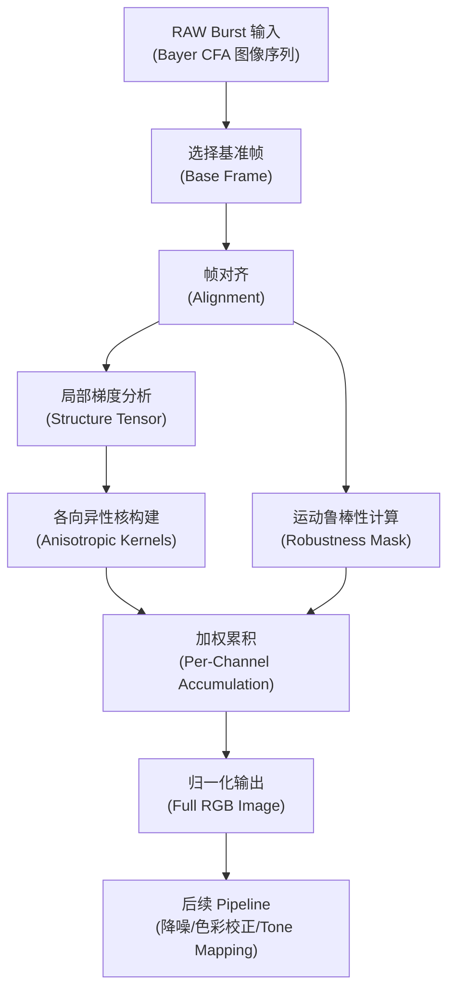

# 手持多帧超分辨率技术文档

> 基于论文 *"Handheld Multi-Frame Super-Resolution"*（Wronski et al., SIGGRAPH 2019）

---

## 1. 技术概述

本算法通过合并一组连拍的 RAW Bayer 图像，**跳过传统去马赛克（Demosaicing）步骤**，直接生成完整 RGB 图像。利用手持拍摄时自然存在的手部微颤（Hand Tremor），获得亚像素级的偏移覆盖，从而实现：

- **超分辨率**：恢复高于单帧像素分辨率的真实光学细节
- **降噪**：多帧时域融合显著提升信噪比
- **消除 Demosaicing 伪影**：避免拉链效应（Zipper）、摩尔纹（Moiré）、假色等

> [!IMPORTANT]
> 该算法在 Google Pixel 手机上实测性能为 **每帧 12MP RAW ≈ 100ms**（Adreno 630 GPU），适合移动端实时处理。

---

## 2. 算法流程总览



### 核心步骤

| 步骤 | 说明 | 输入 | 输出 |
|------|------|------|------|
| 1. 帧采集 | ZSL 模式连拍约 15 帧 RAW | 快门触发 | Bayer RAW burst |
| 2. 帧对齐 | 分层块匹配 + Lucas-Kanade 精化 | 每帧 vs 基准帧 | 每 Tile 的亚像素对齐向量 |
| 3. 核估计 | 梯度结构张量 → 各向异性高斯核 | 每帧的半分辨率亮度 | 核协方差矩阵 Ω |
| 4. 鲁棒性 | 统计模型 + 运动先验 + 噪声校正 | 颜色差异 d, 标准差 σ | 每像素每帧的鲁棒性权重 R̂ |
| 5. 累积合并 | 按通道加权累积并归一化 | 核权重 × 鲁棒性 × 像素值 | 完整 RGB 图像 |

---

## 3. 帧对齐（Registration）

### 3.1 粗对齐：分层块匹配

构建每帧的图像金字塔，在有限窗口内搜索最相似 Tile。

**实施参数**：

| 参数 | 推荐值 | 说明 |
|------|--------|------|
| 金字塔层数 | 4-5 层 | 每层下采样 2× |
| Tile 大小 Ts | 16×16 像素 | 对齐向量的空间分辨率 |
| 搜索窗口 | ±4 像素 | 每层的搜索范围 |
| 匹配度量 | SAD 或 SSD | 块差异计算 |

### 3.2 精对齐：Lucas-Kanade 光流

在块匹配结果基础上，执行 **3 次迭代** Lucas-Kanade 光流，获得亚像素精度对齐。

```
// 伪代码：亚像素精化
for iteration in 0..3:
    warp = applyAlignment(frame, currentAlignment)
    gradient = computeGradient(warp)
    residual = warp - baseFrame
    delta = solveLK(gradient, residual)   // 最小二乘求解
    currentAlignment += delta
```

> [!TIP]
> 论文作者曾尝试二次曲线拟合块匹配误差来估计亚像素偏移，但精度不足以支持超分辨率。Lucas-Kanade 方法在保持低计算成本的同时达到了必要精度。

---

## 4. 手持超分辨率的本质——亚像素覆盖

### 4.1 手部微颤特性

| 特性 | 数值 |
|------|------|
| 频率 | 8-12 Hz |
| 角位移标准差 | ≈ 0.89 像素（86 次连拍实测） |
| 方向分布 | 近似均匀各向同性 |

### 4.2 等分布定理（Equidistribution Theorem）

即使手部运动近似线性，整数像素对齐后的 **亚像素残差**（fractional part）仍近似均匀分布，这由 Weyl 等分布定理保证：

> 序列 {a, 2a, 3a, ... mod 1}（a 为无理数）是均匀分布的。

**实际验证**：论文在 16×16 Tile、20 组连拍序列上验证了亚像素偏移的均匀覆盖性。存在「像素锁定」（Pixel Locking）现象——即估计偏向整数像素值——但不影响整体覆盖。

### 4.3 超分辨率的两个前提条件

1. **输入帧必须存在混叠（Aliased）**：镜头的 Airy 斑直径 < 2 × 像素间距（采样率 < 2）
2. **多帧之间必须有不同的亚像素偏移**：手部微颤天然提供

> [!NOTE]
> 主流手机（iPhone X, Pixel 3）主摄的采样率约 1.5-1.8，满足混叠条件。Bayer CFA 使绿通道混叠增加 50%，红/蓝通道可达 2 倍。

---

## 5. 核回归合并（Kernel Regression Merge）

### 5.1 核心公式

对每个输出像素的每个颜色通道，合并公式为：

$$
C(x, y) = \frac{\sum_n \sum_i c_{n,i} \cdot w_{n,i} \cdot \hat{R}_n}{\sum_n \sum_i w_{n,i} \cdot \hat{R}_n}
$$

其中：
- $n$ ：帧索引
- $i$ ：3×3 邻域内的采样索引
- $c_{n,i}$ ：该帧该采样点的 Bayer 像素值（仅贡献对应颜色通道）
- $w_{n,i}$ ：核权重
- $\hat{R}_n$ ：该帧在该像素处的鲁棒性权重

### 5.2 各向异性高斯核

核权重使用二维非归一化各向异性高斯 RBF ：

$$
w_{n,i} = \exp\left(-\frac{1}{2} \mathbf{d}_i^T \Omega^{-1} \mathbf{d}_i\right)
$$

其中：
- $\mathbf{d}_i = [x_i - x_0, y_i - y_0]^T$ 是采样点到输出像素的偏移向量
- $\Omega$ 是核协方差矩阵

### 5.3 核协方差矩阵的计算

#### 步骤 1：构建半分辨率亮度图

将 Bayer 图像每个 2×2 RGGB Quad 组合为一个亮度像素，得到半分辨率单通道图像。

#### 步骤 2：计算梯度结构张量

$$
\hat{\Omega} = \begin{bmatrix} I_x^2 & I_x I_y \\ I_x I_y & I_y^2 \end{bmatrix}
$$

在 3×3 颜色窗口内通过前向差分计算 $I_x$ 和 $I_y$。

#### 步骤 3：特征分解

对结构张量做特征分析，得到：
- 两个正交方向向量 $\mathbf{e}_1, \mathbf{e}_2$
- 两个特征值 $\lambda_1, \lambda_2$（$\lambda_1 \geq \lambda_2$）

#### 步骤 4：构建核协方差

$$
\Omega = [\mathbf{e}_1, \mathbf{e}_2] \begin{bmatrix} k_1 & 0 \\ 0 & k_2 \end{bmatrix} \begin{bmatrix} \mathbf{e}_1^T \\ \mathbf{e}_2^T \end{bmatrix}
$$

其中 $k_1, k_2$ 由特征值驱动：

| 区域类型 | $\lambda_1$ | $\lambda_1/\lambda_2$ | 核形状 | 效果 |
|----------|-----------|---------|--------|------|
| 平坦区 | 小 | ≈ 1 | 大而圆 | 强降噪 |
| 边缘 | 大 | >> 1 | 沿边拉长 | 沿边平滑，跨边保锐 |
| 细节区 | 大 | ≈ 1 | 小而圆 | 增强分辨率 |

**核控制参数**（参考论文补充材料）：

```
// 伪代码：核参数计算
featureStrength = sqrt(lambda1)  // 主特征值
anisotropy = lambda1 / max(lambda2, epsilon)

// 细节增强 vs 降噪权衡
if featureStrength > detailThreshold:
    k_detail = 0.05  // 小核，增强分辨率
else:
    k_detail = 0.5   // 大核，强降噪

// 各向异性控制
k_stretch = 4.0  // 沿边方向拉伸因子
k_shrink = 2.0   // 垂直边方向收缩因子

k1 = k_detail * k_stretch  // 沿边方向（e1 方向）
k2 = k_detail / k_shrink   // 垂直边方向（e2 方向）
```

> [!WARNING]
> 当 `k_stretch = 1, k_shrink = 1`（各向同性核）时，边缘附近的微小对齐误差会导致严重的拉链伪影。推荐 `k_stretch = 4, k_shrink = 2`。

### 5.4 实施细节

- 结构张量在 **半分辨率** 计算以节省性能和抗噪
- 核协方差值通过 **双线性插值** 上采样到全分辨率
- 每个输出像素独立处理 9 个最近邻采样（3×3）
- GPU 上采用 **Gather 模式**：每个输出像素独立处理一次

---

## 6. 运动鲁棒性模型（Motion Robustness）

### 6.1 核心问题

如何区分「混叠」（需要保留，用于超分辨率）和「对齐错误」（需要拒绝）？

### 6.2 统计鲁棒性模型

$$
R = s \cdot \exp\left(-\frac{d^2}{\sigma^2}\right) - t
$$

其中：
- $d$ ：基准帧与对齐帧之间的颜色差异
- $\sigma$ ：基准帧的局部空间标准差
- $s, t$ ：可调缩放和阈值参数

**三种情况的处理逻辑**：

| 条件 | 含义 | 处理方式 |
|------|------|----------|
| $d \ll \sigma$ | 差异远小于局部方差 | 合并（降噪） |
| $d \approx \alpha \cdot \sigma$ | 差异接近局部方差的某个比例 | 合并（超分辨率） |
| $d \gg \sigma$ | 差异远大于局部方差 | 拒绝（对齐错误/运动） |

### 6.3 Guide Image 构建

创建半分辨率 RGB Guide Image：

```
// 伪代码：从 Bayer Quad 创建 Guide Pixel
for each 2x2 Bayer Quad [R, Gr, Gb, B]:
    guide.R = R
    guide.G = (Gr + Gb) / 2.0
    guide.B = B
```

### 6.4 噪声校正的局部统计量

RAW 图像的噪声是 **异方差高斯噪声**（Heteroscedastic Gaussian），方差是信号亮度的线性函数：

$$
\text{Var}(noise) = \alpha \cdot \text{brightness} + \beta
$$

其中 $\alpha$（slope）和 $\beta$（intercept）来自传感器噪声模型。

**校正流程**：

```
// 1. 测量值（来自 3×3 邻域）
sigma_ms = spatialStdDev(guideImage, 3x3)
d_ms = colorDiff(baseGuide, alignedGuide)

// 2. 噪声模型预期值（通过蒙特卡洛预计算查找表）
sigma_md = lookupNoiseStdDev(brightness, noiseModel)
d_md = lookupNoiseDiff(brightness, noiseModel)

// 3. 噪声校正
sigma = max(sigma_ms, sigma_md)                          // 下界截断
d = d_ms * d_ms^2 / (d_ms^2 + d_md^2)                   // Wiener 收缩
```

> [!IMPORTANT]
> 噪声校正至关重要。在低光条件下，缺少噪声校正会导致大量正确对齐的帧被错误拒绝（噪声导致的差异 $d_{ms}$ 偏大），汇聚帧数不足，无法有效降噪。

### 6.5 运动先验（Motion Prior）

分析对齐向量场的 **局部变化**，判断是否存在局部运动：

$$
M_x = \max_{j \in N_3} v_x(j) - \min_{j \in N_3} v_x(j)
$$
$$
M_y = \max_{j \in N_3} v_y(j) - \min_{j \in N_3} v_y(j)
$$
$$
M = \sqrt{M_x^2 + M_y^2}
$$

判断逻辑：

```
// 在 3×3 Tile 邻域内计算对齐向量的 span
if M > M_threshold:
    // 局部运动或对齐失败 → 更严格的鲁棒性
    s_final = s
else:
    // 纯相机运动，对齐可靠 → 更宽松的鲁棒性
    s_final = s * s  // s^2，更宽松
```

> [!NOTE]
> 仅相机运动时，对齐场应平滑连续。局部运动或遮挡会导致对齐场在局部出现剧烈变化。

### 6.6 形态学精炼

在 5×5 窗口内取最小鲁棒性值：

$$
\hat{R} = \min_{j \in N_5} R(j)
$$

这确保了边缘附近的错误对齐区域也被正确拒绝。

---

## 7. 输出与后处理

### 7.1 输出格式

- 默认输出 **与输入相同分辨率** 的完整 RGB 图像
- 可指定 **任意目标放大倍率**，无需额外重采样
- 可保存为 Linear DNG 格式（非 CFA raw）

### 7.2 有效放大倍率

| 放大倍率 | 效果 | 说明 |
|---------|------|------|
| 1.0× | 替代 Demosaicing，消除伪影 | 最佳质量提升 |
| 1.5× | 显著分辨率提升 | 与大多数手机光学匹配 |
| 2.0× | 有限分辨率提升 | 接近光学极限 |
| 3.0× | 无额外分辨率增益 | 受镜头 Airy 斑限制 |

### 7.3 后续 Pipeline

合并后的全 RGB 图像可直接进入标准处理流：
1. 空间降噪
2. 色彩校正（CCM）
3. Tone Mapping
4. 锐化（Unsharp Mask，推荐 σ = 3 像素）

---

## 8. 性能参数

### 8.1 计算性能

| 平台 | 固定开销 | 每帧每百万像素 | 内存 |
|------|---------|--------------|------|
| Adreno 630 (Mobile) | 15.4 ms | 7.8 ms/MPix | 22 MB/MPix |
| GTX 980 (Desktop) | 0.83 ms | 0.4 ms/MPix | 22 MB/MPix |

**12MP × 15帧** 典型处理时间 (Adreno 630) ≈ 15.4 + 7.8 × 12 × 15 ≈ **1.4s**

### 8.2 关键优势

- 内存使用 **不随帧数增长**（在线处理方式）
- 计算复杂度 **线性扩展**（像素数 × 帧数）
- 比 DeepJoint + FRVSR 快 **数个数量级**

---

## 9. SNR 自适应调参

核的调参需根据 **基准帧的 SNR** 自动调整：

| SNR 范围 | 策略 | 核行为 |
|----------|------|--------|
| 高 SNR（> 30 dB） | 偏重超分辨率 | 小核，增强细节 |
| 中 SNR（20-30 dB） | 平衡 | 中等核大小 |
| 低 SNR（< 20 dB） | 偏重降噪 | 大核，强时域降噪 |

SNR 估计方式：

```
avgBrightness = mean(baseFrame)
noiseVariance = alpha * avgBrightness + beta  // 噪声模型
SNR_linear = avgBrightness / sqrt(noiseVariance)
SNR_dB = 20 * log10(SNR_linear)
```

> [!TIP]
> 论文指出在高 SNR 条件下，7 帧左右即可达到接近峰值质量（PSNR > 40 dB）。低 SNR 条件下 15 帧仍有持续的质量提升。

---
